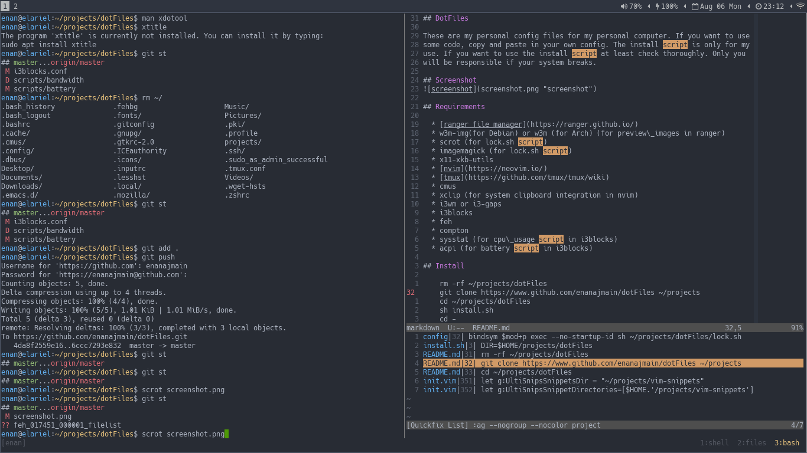

## DotFiles

These are my personal config files for my personal computer. If you want to use
some code, copy and paste in your own config. The install script is only for my
use. If you want to use the install script at least check thoroughly. Only you
will be responsible if your system breaks.

## Screenshot

## Requirements

* Build from source:
    * [Compton](https://github.com/yshui/compton)
    * [i3-gaps](https://github.com/Airblader/i3)
    * [i3blocks](https://github.com/vivien/i3blocks)
    * [tmux](https://github.com/tmux/tmux)
    * [nvim](https://neovim.io/)
    * [MuPDF](https://mupdf.com)
    * [dmenu](https://tools.suckless.org/dmenu)
    * [st](https://st.suckless.org)
    * [vifm](https://vifm.info)

* Install from official package managers:
    * acpi (for battery script i3blocks)
    * cmus (music player)
    * curl (console downloader)
    * deluge (torrent downloader)
    * easytag (mp3 tag editor)
    * feh (for image viewer)
    * ffmpeg (for video editing and recording)
    * fonts-font-awesome
    * htop
    * i3lock
    * imagemagick (for lock script)
    * mpv (video player)
    * scrot (screenshot utility)
    * silversearcher-ag
    * tree
    * x11-xkb-utils
    * xbacklight (for brightness script in i3blocks)
    * xclip (system clipboard manager)

## Install

    rm -rf ~/projects/dotFiles
    git clone https://www.github.com/enanajmain/dotFiles ~/projects
    cd ~/projects/dotFiles
    sh install.sh
    cd -
